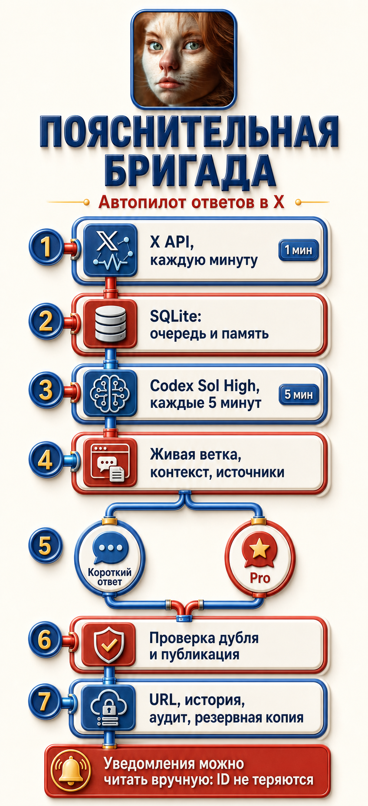

# Пояснительная бригада

[Русский](README.md) | [English](README.en.md)

<p align="center">
  
</p>

Этот репозиторий связывает официальный X API, локальные скрипты и существующую
задачу Codex с авторизованным встроенным Browser. Система обнаруживает новые
прямые ответы и продолжения любых сохраненных диалогов, не зависит от
индикатора непрочитанных уведомлений X, защищается от дублей и передает сильной
модели только реальные события.

<p align="center">
  
</p>

## Лицензия и авторство

Проект опубликован под разрешительной лицензией [MIT](LICENSE). Его можно
свободно клонировать, форкать, изменять, распространять и использовать в своих
проектах, включая коммерческие. В копиях и существенных производных нужно
сохранять уведомление об авторских правах и текст лицензии.

Автор: [Alex Lane](https://x.com/axrbarsic), проект
«Пояснительная бригада». Для научных каталогов и автоматического цитирования
добавлен файл [`CITATION.cff`](CITATION.cff).

## Как это устроено

1. Python watcher каждую минуту читает официальный endpoint упоминаний X.
2. `since_id` и SQLite не дают одному статусу попасть в очередь дважды.
3. `wake-request.json` содержит неразрешенные прямые ответы и продолжения любых
   диалогов, где сохранен ход Alex.
4. Локальный dispatcher выдает новым событиям 30-минутную аренду.
5. Запланированная задача Codex Desktop раз в пять минут завершает пустой run
   либо сама становится Browser owner для непустого claim.
6. Sol High открывает живую ветку X, анализирует текст и изображения, проверяет
   первичные источники, историю диалога и отсутствие дубля.
7. Короткий ответ пишет Sol High. Длинный follow-up может продолжаться только в
   точной исторической сессии кастомного GPT.
8. После публикации сохраняются точный URL, текст, источники и durable
   disposition. Только после этого событие исчезает из очереди.

При `mandatory_response_mode=true` каждое доступное eligible-событие в
заданном временном окне получает ровно один ответ. Поддержка, сарказм, шутка,
оскорбление, мем или реакция без тезиса не являются причинами для `skip`.
`skip` разрешен только при доказанном прямом ответе Alex именно на это событие.

В обязательном режиме каждый ответ, который вернул авторизованный endpoint
упоминаний X, ставится в очередь для живой проверки. Это относится и к ответу
другому участнику, если X продолжает упоминать `@axrbarsic`. Неполная старая
история больше не может скрыть такую ветку.

Watcher и dispatcher сами никогда ничего не публикуют. Авторизованным Browser
управляет только одна задача Sol High.

## Зачем такое разделение

- Получение и дедупликация X выполняются Python без токенов модели.
- Пустой Sol High run завершается до Browser и содержательной работы.
- Ручное открытие уведомлений X не ломает обнаружение, потому что watcher
  использует ID статусов API, а не синий индикатор интерфейса.
- Аренда dispatcher предотвращает повторные пробуждения, пока идет обработка
  или генерация Pro.
- Если задача упала, событие снова станет доступно после окончания аренды.
- SQLite, ledger и история ветки защищают от повторной публикации.
- Каждый непустой scheduled run является единственным Browser owner своего
  batch. Аренда не позволяет параллельному run получить тот же claim.

## Быстрый старт

Требуются macOS, Python 3.9 или новее, Codex Desktop с встроенным Browser,
X Developer App и Bearer Token с доступом к user mentions.

```bash
cp config.example.json config.json
```

Укажите в `config.json` числовой X user ID. Токен не записывайте в файл.
Сохраните его в macOS Keychain с помощью bundled helper:

```bash
mkdir -p var
xcrun swiftc -framework Security \
  scripts/keychain_helper.swift \
  -o var/keychain-helper

printf '%s' "$X_BEARER_TOKEN" | \
  var/keychain-helper set axrbarsic-x-mention-watcher axrbarsic
```

Проверьте готовность и тесты:

```bash
python3 project_layout_audit.py --config config.json \
  --require-installed-skill
python3 xmention_watcher.py --config config.json preflight
python3 -m unittest discover -s tests -v
```

Сделайте первый poll вручную и проверьте очередь:

```bash
python3 xmention_watcher.py --config config.json poll
python3 xmention_watcher.py --config config.json status
```

После этого установите два LaunchAgent и создайте запланированную задачу Codex
Desktop на Sol High по
[русскому руководству автопилота](docs/autopilot-setup.ru.md) и
[deployment checklist](docs/deployment-checklist.md).

## Важные контракты

- Один Browser owner, одна вкладка X, одна вкладка ChatGPT.
- На iMac с 8 GB памяти одновременно работает максимум одна Pro generation.
- Публикационные решения принимает только Sol High.
- Новая Pro-цель начинает новую conversation.
- Follow-up к Pro продолжает точную историческую conversation.
- В custom GPT отправляется только screenshot цели и 0 символов текста.
- Ответ custom GPT переносится без смыслового редактирования.
- Разрешенная длина X ответа: от 1 до 4000 Unicode code points.
- Перед публикацией проверяются дубль, parent status, composer и фактический URL.
- Media-only ответ классифицируется относительно точного parent, а незнакомый
  мем проверяется по интернет-источникам.
- `blocked` не подменяется `skip`, если обязательная историческая сессия или
  другой контрактный ресурс недоступен.
- Terminal `blocked` требует точного `blocker_code`. Временная ошибка Browser,
  Pro, rate limit или валидации остается в очереди для повтора.
- `required_pro_model_unavailable` используется, только если точная
  историческая conversation существует, но требуемая Pro-модель в ней
  недоступна.
- `target_screenshot_unavailable` используется только после повторных
  проверенных попыток, когда обязательный чистый screenshot цели невозможно
  получить и безопасного контрактного обхода нет.
- `memory-audit` проверяет целостность SQLite, foreign keys, стабильные X user
  ID, точную историю, resolutions и карантин candidate corpus. Пока официальный
  архив готовится, нормальный статус равен `archive_pending`.
- `memory-audit --require-archive` является финальным fail-closed gate. Он
  требует импорт официального архива именно владельца из `config.json`,
  согласованные счетчики публикаций, canonical URL, account alias и ноль
  импортированных личных сообщений.
- `memory_snapshot.py --config config.json` создаёт согласованную SQLite-копию,
  exports и SHA-256 manifest. Live SQLite, WAL и SHM напрямую в облако не
  копируются.
- Весь исполняемый проект хранится в одном каноническом каталоге. Его точная
  карта и границы внешних deployment points описаны в
  [docs/project-layout.ru.md](docs/project-layout.ru.md).
- Старые Browser-owner evidence переносятся в канонический `var/evidence`
  через fail-closed importer с SHA-256 manifest, без изменения исходника:

```bash
python3 evidence_import.py \
  --source /absolute/path/to/legacy-work \
  --label legacy-browser-owner-YYYY-MM-DD
python3 evidence_import.py \
  --audit var/evidence/browser-owner/legacy-browser-owner-YYYY-MM-DD
```

CLI всегда пишет только в канонический `var/evidence/browser-owner`;
произвольного output path у него нет.

- Единый локальный layout и независимый зашифрованный online backup описаны в
  [docs/storage-and-backup.ru.md](docs/storage-and-backup.ru.md).
- Единый итоговый fail-closed gate описан в
  [docs/readiness-audit.ru.md](docs/readiness-audit.ru.md) и запускается через
  `python3 readiness_audit.py`.
- Исполняемый контракт находится в `restic_backup.py`. Он сохраняет только
  проверенные memory snapshots, manifested Browser evidence и внешний vault
  официальных архивов. Настройка Keychain, preflight, retention, проверки
  repository и restore drills описаны в документе о хранении.
- На оскорбление публикуется спокойный умный ответ без встречного оскорбления.
  Экспериментальный media-маршрут может использовать одного бота `377` или
  `Ложкин`, но картинка высмеивает аргумент, а не внешность или достоинство.
- Перед ответом Sol получает компактную межветочную память автора по стабильному
  X user ID: точные публичные реплики, даты, URL и наши точные ответы.
  `commenter-history` позволяет поднять более глубокую историю без ограничения
  по давности. Прежнюю цитату можно использовать для доказуемого противоречия,
  смены критерия или повторения уже разобранного тезиса, но не для домыслов о
  личности, чувствительных характеристиках или навязчивого преследования.
- Официальный архив X может дополнить память старыми публичными постами и
  ответами Alex. Импортер проверяет числовой ID аккаунта, по умолчанию работает
  только в dry-run, импортирует лишь публичные посты, игнорирует личные
  сообщения и запрещает конфликтующие перезаписи. Архив X не содержит полной
  копии всех ответов других пользователей, поэтому входящие реплики по-прежнему
  подтверждаются watcher и живой веткой Browser.
- Внешний корпус публичных постов можно загрузить в отдельный карантинный
  индекс кандидатов. Такие записи являются только подсказками для поиска.
  Автопилот получает не более трех подсказок по стабильному X user ID с
  `usable_as_evidence=false`. Использовать запись как доказательство можно
  только после append-only проверки точного живого поста X или официального
  ответа X API.

```bash
python3 xmention_watcher.py --config config.json commenter-history EVENT_ID \
  --limit 50
```

## Импорт официального архива X

Не добавляйте ZIP, распакованный архив, рабочую SQLite-базу или отчёт импорта в
Git. В них могут находиться приватные данные аккаунта. Храните их только в
защищённом локальном месте.

Для штатного приёма используйте двухфазный оркестратор. Он требует исходный
ZIP вне каталога проекта, проверяет владельца и публичные members, вычисляет
SHA-256 и записывает план рядом с архивом:

```bash
python3 archive_intake.py \
  --config config.json \
  --archive /Users/alexlane/Archives/x-mention-watcher/YYYY-MM-DD/source.zip
```

План должен показать ожидаемый числовой ID аккаунта, имя пользователя, число
публичных постов и `direct_messages_imported: 0`. Отдельно перечисляются
приватные файлы архива, которые намеренно не читались и не импортировались.

После проверки примените тот же неизменившийся ZIP:

```bash
python3 archive_intake.py \
  --config config.json \
  --archive /Users/alexlane/Archives/x-mention-watcher/YYYY-MM-DD/source.zip \
  --apply
```

Apply отказывается работать без совпадающего dry-run плана. До изменения базы
создаётся согласованный snapshot, затем выполняются append-only импорт, полный
`memory-audit --require-archive` и второй snapshot. Внешний
`reports/intake-receipt.json` связывает SHA-256 ZIP, результат импорта и оба
snapshot. Низкоуровневый `x_archive_import.py` остаётся библиотекой и
диагностическим CLI, но обычный production-путь проходит через
`archive_intake.py`.

Импорт идемпотентен: повтор того же архива возвращает `already_imported`.
Следующий архив может добавить новые посты, но изменение неизменяемых полей
существующего status ID завершает импорт с ошибкой. Исторические ответы Alex
попадают в отдельный раздел памяти `archive_alex_replies` и связываются с
собеседником по стабильному X user ID. Отсутствующий текст чужой реплики
никогда не выдумывается.

## Импорт внешнего корпуса кандидатов

Этот путь предназначен только для публичных данных X, собранных вне
официального архива и live watcher. В каждой строке JSONL должны быть числовой
status ID, ожидаемый handle аккаунта, ссылка на статус X и состояние проверки
источника.

Сначала выполните dry-run:

```bash
python3 candidate_corpus.py \
  --config config.json \
  import \
  --input /absolute/path/to/public-posts.jsonl \
  --subject-user-id 123456789 \
  --handle example_user
```

Примените проверенный корпус:

```bash
python3 candidate_corpus.py \
  --config config.json \
  import \
  --input /absolute/path/to/public-posts.jsonl \
  --subject-user-id 123456789 \
  --handle example_user \
  --apply
```

Посмотрите кандидатскую память для существующего входящего события:

```bash
python3 candidate_corpus.py \
  --config config.json \
  history EVENT_ID \
  --limit 20
```

Непроверенный кандидат нельзя цитировать или считать доказательством. После
открытия точного живого поста или чтения через официальный X API сохраните
точный текст в локальный файл и добавьте append-only проверку:

```bash
python3 candidate_corpus.py \
  --config config.json \
  verify STATUS_ID \
  --url https://x.com/example_user/status/STATUS_ID \
  --exact-text-file /absolute/private/path/exact-text.txt \
  --observed-at 2026-07-25T20:00:00Z \
  --method live_x_dom
```

Проверенный текст хранится отдельно и не перезаписывает исходного кандидата.
Конфликтующая повторная проверка завершается с ошибкой.

После включения строгого режима можно без списка event ID вернуть недавние
content-based skips и ошибочно проигнорированные ответы из упоминаний в обычную
очередь:

```bash
python3 xmention_watcher.py --config config.json mandatory-response-requeue \
  --hours 12 --as-of 2026-07-25T20:00:00Z --dry-run
python3 xmention_watcher.py --config config.json mandatory-response-requeue \
  --hours 12 --as-of 2026-07-25T20:00:00Z
```

Эта же команда используется для чистого эксперимента после исправления слабого
звена. Dry-run и apply получают один и тот же `as-of`, после чего обычная
запланированная задача Sol сама должна найти событие. Известный event ID нельзя
вручную подставлять в очередь или prompt. Полный переносимый протокол находится
в
[`reliability-debugging.md`](skill-backup/x-twitter-operator/references/reliability-debugging.md).

## Состояние и восстановление

```bash
python3 xmention_watcher.py --config config.json status
python3 scripts/autopilot_dispatch.py \
  --config config.json \
  --lease-seconds 1800 \
  status

python3 scripts/autopilot_dispatch.py \
  --config config.json \
  snapshot

python3 scripts/autopilot_bridge.py \
  --config config.json \
  --lease-seconds 1800 \
  claim
```

Runtime-файлы, SQLite, токены, Browser cookies и локальные журналы исключены из
Git. В репозитории хранятся только код, тесты, документация, шаблоны и backup
skill. Историю диалогов можно экспортировать отдельно в приватный backup:

```bash
python3 xmention_watcher.py --config config.json history-export \
  --output var/exports/conversation-history.jsonl
```

Подробная архитектура находится в [docs/architecture.md](docs/architecture.md).
