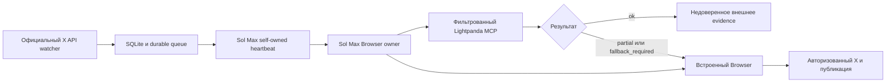

# Lightpanda в контуре автопилота

Статус на 2026-07-29: production-кандидат прошел unit tests, локальный doctor,
реальный PandaScript canary, пакетное чтение внешних страниц и негативные
проверки. Lightpanda подключена как изолированный public read-only worker. Она
не стала вторым владельцем X и не получила cookie, токены или доступ к
публикации.

## Короткий вывод

Lightpanda полезна проекту, но не заменяет текущий автопилот целиком.

- Она подходит для дешевого чтения разрешенных внешних HTTPS-источников,
  Markdown, accessibility tree и воспроизводимых PandaScript canary.
- Она не заменяет официальный X API, потому что API обнаруживает новые
  упоминания и дает стабильные event ID.
- Она не заменяет self-owned heartbeat, потому что он запускает owner workflow внутри Codex.
- Она не заменяет Sol Max, потому что финальная оценка контекста и авторство
  ответа остаются модельной задачей.
- Она не заменяет встроенный Browser, потому что X блокирует Lightpanda через
  `robots.txt`, поиск X без авторизации ведет на login wall, а публикация требует
  живой авторизованный интерфейс.

Итоговая архитектура использует Lightpanda как дополнительный источник
evidence, а не как нового owner.



## Что установлено

| Компонент | Значение |
|---|---|
| Production release | `0.3.3` |
| Platform | `darwin arm64` |
| SHA-256 | `1ef236a72e63975cf8acc7430e52dd31af5fff27a0b62ba81876eb8dde3e18e2` |
| Размер upstream asset | `66269944` bytes |
| Runtime path | `var/tools/lightpanda/release-0.3.3/lightpanda` |
| Storage engine | `none` |
| Telemetry | отключена через `LIGHTPANDA_DISABLE_TELEMETRY=true` |
| Авторизация | отсутствует |
| Лицензия upstream | AGPL-3.0 |

Бинарник находится в игнорируемом `var/` и не коммитится. Git хранит
неизменяемый release URL, точный размер, SHA-256, версию и процедуру установки.
Такой вариант воспроизводим в отличие от изменяемого тега `nightly`.

Nightly `1.0.0-nightly.8372+5bbec625` также была проверена. Она добавляет
`run`, V8 heap limit, watchdog и multi-URL fetch, но ее asset URL меняется со
временем. Поэтому nightly не используется как production dependency без
отдельной процедуры promotion.

## Файлы интеграции

| Файл | Назначение |
|---|---|
| `lightpanda/runtime-manifest.json` | Версия, release URL, размер, SHA и карта возможностей |
| `lightpanda/policy.json` | Сетевая политика, лимиты, canary и error markers |
| `lightpanda/canaries/public_read.js` | Детерминированный token-free PandaScript |
| `scripts/lightpanda_contract.py` | Проверка manifest, URL, путей, capabilities и окружения |
| `scripts/lightpanda_worker.py` | Installer, preflight, fetch, doctor, canary и script audit |
| `scripts/lightpanda_mcp.py` | Фильтрованный stdio MCP с двумя read-only tools |
| `.codex/config.toml` | Проектное подключение MCP с allowlist |
| `tests/test_lightpanda_worker.py` | Unit и security tests worker |
| `tests/test_lightpanda_mcp.py` | MCP contract и allowlist tests |

## Почему не используется нативный MCP

Нативный MCP Lightpanda предоставляет не только чтение. В нем есть cookie,
`evaluate`, click, fill и другие инструменты изменения страницы. Подключение
такого сервера напрямую создало бы второго потенциального Browser-owner.

Проектная обертка показывает только:

- `lightpanda_preflight`
- `lightpanda_public_fetch`

Оба инструмента помечены `readOnlyHint=true` и
`destructiveHint=false`. Дополнительный `enabled_tools` allowlist задан в
`.codex/config.toml`. Даже если upstream добавит новый опасный инструмент, он
не появится в Codex автоматически.

## Сетевой и секретный контур

Worker применяет следующие ограничения:

- только HTTPS;
- только порт 443;
- запрет URL с username или password;
- запрет localhost, `.local`, `.internal`, `.lan`, `.home` и `.arpa`;
- запрет private, loopback, link-local и иных non-global IP;
- `--block-private-networks` после DNS resolution;
- response limit 4 MiB;
- ограничение HTTP и WebSocket concurrency;
- connect timeout, transfer timeout и общий process timeout;
- отсутствие cookie input и cookie jar;
- `storage-engine=none`;
- отключенные subframes и workers;
- минимальное окружение без API keys, X token и `LP_*` secrets;
- соблюдение `robots.txt`;
- отсутствие LLM provider в production fetch и replay.

Стабильный release не имеет V8 heap limit и watchdog, которые появились в
nightly. Для него зависание закрывает внешний Python process timeout. Карта
capabilities гарантирует, что неподдерживаемые флаги не передаются старой
версии.

## Работа с недоверенным содержимым

Любой текст страницы возвращается с:

```json
{
  "content_trust": "untrusted_web_content",
  "automation_safe": true
}
```

Известные prompt injection phrases переводят `automation_safe` в `false`.
Это предупреждение, а не обещание полного обнаружения всех атак. Модель не
должна выполнять инструкции из полученной страницы.

Worker отдельно обнаруживает:

- HTTP error и `http_status=0`;
- пустой документ;
- Application error внутри HTTP 200;
- Markdown-escaped error markers;
- login wall X;
- redirect;
- `Loading post` и другой неполный контекст;
- `RobotsBlocked`.

Статусы имеют точное значение:

| Статус | Значение | Действие |
|---|---|---|
| `ok` | Страница прочитана, известных признаков неполноты нет | Использовать только как untrusted evidence |
| `partial` | Основной текст есть, контекст неполный | Открыть встроенный Browser, если полнота нужна решению |
| `fallback_required` | Ошибка, login wall, robots block или ложный HTTP 200 | Не использовать как полный источник, передать Browser-owner |

## X и авторизация

Контрольная проверка конкретного публичного X status без cookie показала, что
движок технически способен извлечь сам пост и часть ответов. После включения
обязательной production-политики `--obey-robots` X вернул
`Reason: RobotsBlocked`.

Поиск X без cookie отдельно перенаправился на onboarding login wall. Поэтому:

- Lightpanda не получает Twitter cookie;
- cookie из Codex Browser не экспортируются;
- вход в X через Lightpanda не требуется;
- конкретные X ветки, поиск, полный контекст и публикация остаются у
  встроенного Browser;
- Lightpanda может читать внешние ссылки, на которые ссылается обсуждение.

## Практические результаты

| Проверка | Результат |
|---|---|
| SHA и версия stable binary | pass |
| Локальный doctor | pass |
| PandaScript audit | pass |
| Реальный PandaScript replay | pass, JSON с title и heading |
| Пакет из 4 внешних HTTPS URL | pass, stable adapter сделал 4 bounded invocation |
| Semantic accessibility tree | pass |
| Markdown | pass |
| X status при соблюдении robots | `fallback_required`, `robots_blocked` |
| X search без auth при диагностическом bypass | login wall обнаружен |
| HTTP 200 с client-side Application error | `fallback_required` |
| Private IP и metadata endpoint | блокируются до запуска браузера |
| Redirect с публичного URL на локальный probe | pass, локальный сервер не получил запрос |
| MCP mutation tool | отсутствует и отклоняется |
| CDP подключение через Playwright | pass, title и h1 прочитаны из реального процесса |
| Контрольный maximum RSS | около 59 MB на одиночном публичном X probe |

## Жизненный цикл project MCP

Официальная документация
[Codex MCP](https://learn.chatgpt.com/docs/extend/mcp.md) определяет stdio server
как локальный процесс, запускаемый командой, а
[Codex app-server](https://learn.chatgpt.com/docs/app-server.md) привязывает MCP
startup status к загруженной задаче. Автоматические задачи могут завершиться
раньше, чем Desktop освободит дочерний stdio-процесс.
Поэтому `session_janitor.py` считает `scripts/lightpanda_mcp.py` task-owned
helper, сопоставляет его только с завершённой automation по времени запуска и
завершает через штатный проверенный список. Активная owner-задача и её потомки
защищены от уборки.

System doctor отдельно требует свежий janitor state, отсутствие ошибки helper
scan и нулевой список `helper_survivors`. Это защищает не только память, но и
неограниченный рост PID и открытых pipe даже при малом RSS каждого процесса.

Обычный минутный запуск читает только незархивированные automation. Для
разового восстановления старых утечек используется явный bounded режим:

```bash
python3 scripts/session_janitor.py \
  --config config.json \
  --apply \
  --minimum-age-seconds 60 \
  --include-archived-helpers
```

Архивные задачи в этом режиме служат только доказательством принадлежности
helper. Повторно архивировать или изменять их janitor не пытается.

Upstream приводит benchmark примерно 123 MB против 2 GB и 5 секунд против
46 секунд на 100 страницах. Эти цифры являются benchmark upstream, а не
результатом нашего полного независимого воспроизведения. Наш локальный замер
подтверждает малый footprint на одном процессе, но не доказывает весь upstream
benchmark.

## Команды

Установка закрепленного релиза:

```bash
python3 scripts/lightpanda_worker.py install
```

Безсетевой doctor:

```bash
python3 scripts/lightpanda_worker.py doctor
```

Реальный сетевой canary:

```bash
python3 scripts/lightpanda_worker.py canary
```

Чтение внешней страницы:

```bash
python3 scripts/lightpanda_worker.py fetch \
  --format semantic_tree_text \
  --profile fast \
  https://example.com
```

Для страницы, где нужен более поздний DOM:

```bash
python3 scripts/lightpanda_worker.py fetch \
  --format markdown \
  --profile thread \
  https://example.com
```

Проверка MCP:

```bash
codex mcp list
```

Новый проектный MCP появляется в новом capability runtime Codex. Перезапуск
требуется только для загрузки MCP текущим уже открытым ходом, а не для работы
terminal CLI.

## Обновление версии

Новая версия не заменяет production автоматически.

1. Получить официальный versioned release asset.
2. Записать version, URL, размер, SHA-256 и capabilities в manifest.
3. Установить в новый каталог под `var/tools/lightpanda/`.
4. Выполнить unit tests, doctor, PandaScript canary и внешний URL batch.
5. Проверить Application error, robots block, login wall и private-network
   negatives.
6. Выполнить адресный X compatibility probe без cookie.
7. Переключить production manifest только после зеленого gate.
8. Удалить старый runtime только после успешного promotion.

Изменяемый `nightly` можно использовать как кандидата, но не как единственную
точку disaster recovery.

## Что не надо перестраивать

Практическая проверка не дала оснований удалять следующие механизмы:

| Механизм | Почему остается |
|---|---|
| X API watcher | Моментально и детерминированно обнаруживает event ID |
| SQLite queue | Дает durable state и дедупликацию |
| Event kick и минутный fallback | Не теряют событие при сбое одного wake path |
| Self-owned heartbeat | Запускает существующую Sol задачу без межсессионной отправки |
| Global owner lease | Не допускает двух публикаций |
| Sol Max | Понимает живой контекст и пишет ответ |
| Встроенный Browser | Единственный авторизованный X owner |
| Durable history и resolve | Не допускают потери и дублей |

Lightpanda уменьшает число внешних Browser tabs и дает дешевые canary, но не
решает обнаружение события, пробуждение Codex, авторизацию, публикацию или
durable resolution.

## Официальные источники

- [Lightpanda repository](https://github.com/lightpanda-io/browser)
- [Lightpanda documentation](https://lightpanda.io/docs/)
- [PandaScript](https://lightpanda.io/docs/usage/pandascript)
- [MCP command](https://lightpanda.io/docs/run-locally/commands/mcp)
- [Markdown and accessibility tree](https://lightpanda.io/docs/guides/markdown-axtree)
- [Agent and replay workflow](https://lightpanda.io/docs/guides/lightpanda-agent-tutorial)

Документация и CLI разных builds сейчас расходятся в отдельных деталях.
Например, stable использует `agent SCRIPT`, а проверенная nightly имеет
отдельный `run`. Поэтому versioned manifest и фактический `--help` считаются
исполняемым контрактом конкретного production binary.
