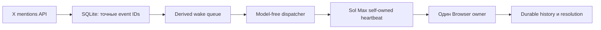

# Аудит надёжности X-автопилота, 2026-08-01

## Короткий вывод

Пропуски возникли не на чтении X. Официальный API обнаруживал события и
сохранял их вовремя. Сбой находился между durable очередью и фактическим
пробуждением Browser owner:

1. Relay направлял follow-up в другую задачу. В scheduled heartbeat вызов
   `send_message_to_thread` мог зависнуть без подтверждения, хотя тот же вызов
   из обычного turn проходил сразу.
2. Ранний маршрут содержал зашитые `threadId` и `hostId`. После обновления
   приложения старый внутренний host перестал быть устойчивой частью адресации.
3. Замена owner была названа так же, как основная задача Alex. Поэтому в
   боковой панели появились два одинаковых «Автопилота».
4. Doctor контролировал свежесть poll и dispatcher, но один ошибочный статус
   dispatcher с непустой очередью мог не считаться остановкой relay.
5. Возраст самого старого X-события не имел независимого SLO. Свежие служебные
   heartbeat могли визуально маскировать старую очередь.

Сейчас одна Sol Max owner-сессия выполняет и heartbeat, и Browser-owner работу.
Отдельный relay thread больше не нужен и архивируется после live canary.

## Исправленный маршрут

Ключевые инварианты:

| Риск | Машинная защита |
| --- | --- |
| Старый адрес worker | Automation target и owner читаются из одного versioned contract |
| Нестабильный внутренний host | Межсессионной адресации и `hostId` больше нет |
| Двойная отправка wake | Короткая атомарная reservation с точным token |
| Два Browser owner | Один глобальный owner claim на всю очередь |
| Doctor прерывает активную публикацию | Repair handoff ждёт завершения X owner; повторная проверка после reservation сужает окно гонки и снимает repair token, если X уже активен |
| Потеря после сбоя | Неразрешённый event остаётся в SQLite и снова доступен после lease |
| Дубли публикации | Exact status ID, история, duplicate gate и проверка direct child reply |
| Скрытая зависшая очередь | `runtime.queue_latency` измеряет `first_seen_at` старейшего event независимо от heartbeat |
| Queue-latency перехватывает собственный recovery | Инцидент только `runtime.queue_latency` уступает relay штатному X handoff; смешанный FAIL по-прежнему идёт в doctor |
| Ошибка dispatcher при pending queue | Любой неожиданный не-waiting статус теперь даёт FAIL |
| Долгая корректная обработка | Старый event активного owner даёт WARN, а не ложный FAIL; renew сохраняет lease |
| Один длинный claim задерживает короткие ответы | Claim ограничен тремя старейшими event; до трёх X-вкладок читают независимые ветки, но одна writer-полоса публикует и durably resolve каждый event сразу |
| Накопление задач | Одна пользовательская задача, один служебный worker, janitor архивирует завершённые служебные задачи |

Версионный предел ожидания очереди сейчас равен 300 секундам. Это не обещание
опубликовать ответ за пять минут, поскольку фактчек и генерация могут быть
дольше. Это предел, после которого отсутствие owner считается аварией. Если
старейшее событие уже находится в активном claim, doctor показывает WARN и
требует проверить renew и durable завершение.

Дополнительный live-инцидент подтвердил, что сохранность очереди сама по себе
недостаточна: event `2083427655852978365` был замечен watcher за 28 секунд, но
получил owner только через 16 минут и продолжил ждать внутри общего пакета из
шести событий. Это классифицировано как пропуск пользовательского времени
реакции, хотя event не был потерян. Поэтому новые claims ограничены тремя
старейшими событиями, независимое чтение разрешено в трёх task-owned X-вкладках,
а публикация, проверка и durable resolve идут строго по одному event. Весь пакет
нельзя готовить целиком перед первой публикацией.

## Проверенные промышленные паттерны

Архитектура сверена с первичными материалами, а не с пересказами:

| Паттерн | Что берём в проект |
| --- | --- |
| [AWS Transactional Outbox](https://docs.aws.amazon.com/prescriptive-guidance/latest/cloud-design-patterns/transactional-outbox.html) | SQLite является источником истины, wake является восстанавливаемым представлением, уведомление выполняется после durable записи |
| [Stripe Idempotency](https://docs.stripe.com/api/idempotent_requests) | Повтор использует тот же event ID, reservation token или claim token и не создаёт вторую мутацию |
| [Microsoft Sequential Convoy](https://learn.microsoft.com/en-us/azure/architecture/patterns/sequential-convoy) | Одна X-цепочка обрабатывается строго последовательно; разные цепочки могут параллельно готовить только read-only исследование |
| [Microsoft Competing Consumers](https://learn.microsoft.com/en-us/azure/architecture/patterns/competing-consumers) | Параллелизм разрешён только для независимой подготовки; один consumer владеет конкретным событием, публикация остаётся сериализованной |
| [Temporal durable execution](https://docs.temporal.io/) | Используем идею возобновления через durable state, lease, renew и retry; отдельную инфраструктуру Temporal сейчас не добавляем |

Полный переход на внешний broker или Temporal сейчас дал бы больше новых
точек отказа, чем пользы для одного Mac. Нужные свойства уже реализуются
локально: durable state, повтор после lease, идемпотентность и проверяемое
завершение. Внешнюю платформу стоит рассматривать только при переносе на
несколько машин.

## Prompt и «Пояснительная бригада v2»

Официальные рекомендации OpenAI требуют versioned prompt, явную структуру,
репрезентативные примеры и eval-driven разработку:

- [Prompt engineering](https://developers.openai.com/api/docs/guides/prompt-engineering)
- [Evaluation best practices](https://developers.openai.com/api/docs/guides/evaluation-best-practices)

Поэтому v1 сохранён без неявной миграции, а экспериментальный v2 установлен
отдельно. V2 применяется только по прямому выбору Alex или в уже помеченной
цепочке. Перед ответом он строит внутреннюю карту:

- исходный тезис и точную цитату;
- главный незакрытый вопрос;
- журнал утверждений, уступок, доказанных противоречий и смен критериев;
- класс последнего хода, например новый факт, уточнение, уход в сторону или
  личный выпад.

V2 не имеет права объявлять уточнение противоречием, считать молчание
признанием или придумывать цитаты. Для заявления о противоречии обязательны две
точные несовместимые формулировки и status IDs. Пять versioned eval cases
проверяют уход в сторону, уточнение, настоящее противоречие, смену критерия и
новое доказательство.

Обе версии генерируются локально в Codex на Sol Max. ChatGPT и custom GPT не
открываются. Ответ непустой, не превышает 4000 Unicode code points и не
дополняется ради лимита.

## Официальное обновление Browser 26.727

[Changelog OpenAI от 2026-07-30](https://learn.chatgpt.com/docs/changelog)
подтверждает следующие новинки:

- адресная строка умеет находить ранее открытые страницы и искать в Google;
- историей Browser можно управлять в настройках, ChatGPT может искать в ней;
- Chrome extension умеет передавать открытые вкладки и выделенный текст;
- добавлены быстрые вопросы к YouTube и команда Ask ChatGPT для страницы;
- заявлены улучшения производительности и исправления ошибок.

[Официальная документация Browser](https://learn.chatgpt.com/docs/browser)
подтверждает отдельный профиль встроенного Browser, прямое управление через
Computer Use и опциональный Developer mode с контролируемым полным CDP для
DOM, console, network и performance diagnostics.

В текущей установке bundled Browser skill имеет версию `26.727.51351`, то есть
нужное поколение уже доступно. В работу приняты такие правила:

1. Адресная строка и history могут быстро вернуть task-owned страницу после
   stale binding.
2. После возврата обязательно повторно проверяются origin, точный status ID и
   фактический target.
3. Browser history не является очередью, памятью диалога, duplicate ledger или
   доказательством публикации.
4. Full CDP используется только для адресной диагностики Browser, DOM или сети
   после явного approval. Для обычного чтения и публикации X он не нужен.
5. Chrome extension не используется вместо встроенного авторизованного owner.

Это ускоряет восстановление UI и диагностику, но не меняет главный принцип:
важное состояние хранится в SQLite и task-owned evidence, а не во вкладках.

## Стоимость без потери ответов

- Пустые poll, gate, doctor, дедупликация и проверка lease работают без модели.
- Отдельный Luna turn для транспорта удалён. Готовая очередь запускает
  существующий Sol Max owner напрямую.
- При открытом Desktop self-owned heartbeat выполняет небольшой gate. Сложная
  Sol Max работа начинается только для реального маршрута.
- «Пояснительная бригада» работает локальным skill без ChatGPT-вкладки и без
  custom GPT.
- X API остаётся отдельным платным внешним ресурсом. Model-free poll экономит
  модельные расходы, но сам запрос X API не становится бесплатным.
- Дорогой Recent Search хвоста ограничен отдельно и не может остановить
  минутные owned mentions.

Экономить за счёт пропуска событий запрещено. Снижение расходов достигается
нулевой модельной работой на пустом состоянии, дедупликацией до модели и
локальной генерацией, а не снижением частоты owned mentions.

## Безопасная граница обновления Desktop

Перезапуск или обновление безопасны, когда одновременно выполнено:

1. `autopilot_bridge gate` возвращает `status=idle`, `dispatch=false` и пустые
   `event_ids`.
2. В dispatcher `owner=null`, нет handoff reservation и work in progress.
3. Supervisor не имеет открытого repair incident.
4. `system_doctor` показывает ноль FAIL.
5. Все task-owned Browser tabs закрыты, а текущий Git checkpoint сохранён.

Во время перезапуска LaunchAgent продолжает durable poll. Если событие придёт в
этот короткий промежуток, оно останется в SQLite и wake queue, а service worker
получит его после возвращения Desktop. Перезапуск нельзя начинать внутри
активной публикационной транзакции.

## Ограниченный следующий шаг

Самые крупные модули пока содержат несколько state machine в одном файле. Их
следует разделять только отдельными bounded checkpoint после стабильной живой
работы. Безопасная очередность:

1. Выделить чистые типы состояния и переходы dispatcher за существующими
   тестами.
2. Отделить чтение X, durable import и resolution в узкие интерфейсы.
3. Добавить per-conversation key для будущего read-only параллелизма.
4. Оставить authenticated inspection и публикацию одной упорядоченной
   транзакцией до появления доказанного безопасного multi-owner протокола.

Массовый рефакторинг в этом repair checkpoint намеренно не выполняется: он
увеличил бы риск именно тогда, когда задача состоит в восстановлении
надёжности.
