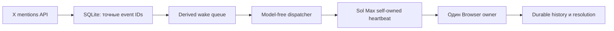

# Аудит надёжности X-автопилота, 2026-08-01

## Короткий вывод

Пропуски возникли не на чтении X. Официальный API обнаруживал события и
сохранял их вовремя. Сбой находился между durable очередью и фактическим
пробуждением Browser owner:

1. Relay направлял follow-up в другую задачу. В scheduled heartbeat вызов
   `send_message_to_thread` мог зависнуть без подтверждения, хотя тот же вызов
   из обычного turn проходил сразу.
2. Ранний маршрут содержал зашитые `threadId` и `hostId`. После обновления
   приложения старый внутренний host перестал быть устойчивой частью адресации.
3. Замена owner была названа так же, как основная задача Alex. Поэтому в
   боковой панели появились два одинаковых «Автопилота».
4. Doctor контролировал свежесть poll и dispatcher, но один ошибочный статус
   dispatcher с непустой очередью мог не считаться остановкой relay.
5. Возраст самого старого X-события не имел независимого SLO. Свежие служебные
   heartbeat могли визуально маскировать старую очередь.

Сейчас одна Sol Max owner-сессия выполняет и heartbeat, и Browser-owner работу.
Отдельный relay thread больше не нужен и архивируется после live canary.

## Исправленный маршрут

Ключевые инварианты:

| Риск | Машинная защита |
| --- | --- |
| Старый адрес worker | Automation target и owner читаются из одного versioned contract |
| Нестабильный внутренний host | Межсессионной адресации и `hostId` больше нет |
| Двойная отправка wake | Короткая атомарная reservation с точным token |
| Два Browser owner | Один глобальный owner claim на всю очередь |
| Doctor прерывает активную публикацию | Repair handoff ждёт завершения X owner; повторная проверка после reservation сужает окно гонки и снимает repair token, если X уже активен |
| Потеря после сбоя | Неразрешённый event остаётся в SQLite и снова доступен после lease |
| Дубли публикации | Exact status ID, история, duplicate gate и проверка direct child reply |
| Скрытая зависшая очередь | `runtime.queue_latency` измеряет `first_seen_at` старейшего event независимо от heartbeat |
| Queue-latency перехватывает собственный recovery | Пара `runtime.relay_progress` и `runtime.queue_latency` имеет одного recovery owner, штатный X route; любой смешанный FAIL с дефектом durability по-прежнему идёт в doctor |
| Ошибка dispatcher при pending queue | Любой неожиданный не-waiting статус теперь даёт FAIL |
| Долгая корректная обработка | Старый event активного owner даёт WARN, а не ложный FAIL; renew сохраняет lease |
| Один длинный claim задерживает короткие ответы | Claim ограничен тремя старейшими event; до трёх X-вкладок читают независимые ветки, но одна writer-полоса публикует и durably resolve каждый event сразу |
| Накопление задач | Один постоянный owner, транзакционная ротация архивирует точную старую задачу, doctor требует единственность новой |

Версионный предел ожидания очереди сейчас равен 300 секундам. Это не обещание
опубликовать ответ за пять минут, поскольку фактчек и генерация могут быть
дольше. Это предел, после которого отсутствие owner считается аварией. Если
старейшее событие уже находится в активном claim, doctor показывает WARN и
требует проверить renew и durable завершение.

Дополнительный live-инцидент подтвердил, что сохранность очереди сама по себе
недостаточна: event `2083427655852978365` был замечен watcher за 28 секунд, но
получил owner только через 16 минут и продолжил ждать внутри общего пакета из
шести событий. Это классифицировано как пропуск пользовательского времени
реакции, хотя event не был потерян. Поэтому новые claims ограничены тремя
старейшими событиями, независимое чтение разрешено в трёх task-owned X-вкладках,
а публикация, проверка и durable resolve идут строго по одному event. Весь пакет
нельзя готовить целиком перед первой публикацией.

Инцидент `2083919639889809717` выявил отдельную ошибку наблюдаемости. Минутный
poll обнаружил событие примерно за 68 секунд и сохранил его в SQLite и wake
queue, но дешёвый mentions route не запрашивает expanded user resources.
Поэтому `author_id=1798148184612446208` сохранился, а `username` был `null`.
Ручной аудит по нику ошибочно сообщил, что события нет, хотя оно ожидало в
общем backlog из 72 событий. Dispatcher ранее выбрасывал `author_id` при
нормализации wake event, поэтому не мог дать автору временный приоритет.

Исправление сохраняет stable `author_id` во всём control-plane payload и
сортирует заданные `inbound_priority_author_ids` раньше общего FIFO. Внутри
одного приоритетного автора порядок остаётся FIFO, чтобы v2 видела спор в
правильной последовательности. Тест воспроизводит точный случай
`username=null`: два события нужного author ID выбираются перед более старым
событием другого автора. Публикационный lease, один writer, duplicate gate и
durable evidence не меняются.

## Проверенные промышленные паттерны

Архитектура сверена с первичными материалами, а не с пересказами:

| Паттерн | Что берём в проект |
| --- | --- |
| [AWS Transactional Outbox](https://docs.aws.amazon.com/prescriptive-guidance/latest/cloud-design-patterns/transactional-outbox.html) | SQLite является источником истины, wake является восстанавливаемым представлением, уведомление выполняется после durable записи |
| [Stripe Idempotency](https://docs.stripe.com/api/idempotent_requests) | Повтор использует тот же event ID, reservation token или claim token и не создаёт вторую мутацию |
| [Microsoft Sequential Convoy](https://learn.microsoft.com/en-us/azure/architecture/patterns/sequential-convoy) | Одна X-цепочка обрабатывается строго последовательно; разные цепочки могут параллельно готовить только read-only исследование |
| [Microsoft Competing Consumers](https://learn.microsoft.com/en-us/azure/architecture/patterns/competing-consumers) | Параллелизм разрешён только для независимой подготовки; один consumer владеет конкретным событием, публикация остаётся сериализованной |
| [Temporal durable execution](https://docs.temporal.io/) | Используем идею возобновления через durable state, lease, renew и retry; отдельную инфраструктуру Temporal сейчас не добавляем |

Полный переход на внешний broker или Temporal сейчас дал бы больше новых
точек отказа, чем пользы для одного Mac. Нужные свойства уже реализуются
локально: durable state, повтор после lease, идемпотентность и проверяемое
завершение. Внешнюю платформу стоит рассматривать только при переносе на
несколько машин.

## Структурный checkpoint

Watcher и doctor разделены по устойчивым границам, а не по случайным helper
функциям. `xmention_watcher.py` остался composition root: он один владеет
process lock и жизненным циклом SQLite connection, затем передает явные
dependencies модулям событий, polling, истории, resolution, аудита, memory,
health, Keychain и HTTP. CLI parser не импортирует runtime state.

Browser evidence теперь имеет одну смысловую реализацию. Один детерминированный
committer проверяет `evidence.json`, историю, parent, URL и terminal disposition,
после чего атомарно импортирует историю и выполняет durable resolve. Session
finalizer только проверяет полноту набора уже committed events и строит
aggregate manifest. Это убирает semantic dual write, при котором два пути могли
по-разному трактовать один и тот же опубликованный ответ.

`system_doctor` также разделен: orchestration и live checks находятся отдельно
от декларативных contract checks. Поэтому добавление одной проверки больше не
требует изменять единый giant conditional и меньше рискует сломать соседний
recovery route.

## Prompt и «Пояснительная бригада v2»

Официальные рекомендации OpenAI требуют versioned prompt, явную структуру,
репрезентативные примеры и eval-driven разработку:

- [Prompt engineering](https://developers.openai.com/api/docs/guides/prompt-engineering)
- [Evaluation best practices](https://developers.openai.com/api/docs/guides/evaluation-best-practices)

Поэтому v1 сохранён без неявной миграции, а экспериментальный v2 установлен
отдельно. V2 применяется только по прямому выбору Alex или в уже помеченной
цепочке. Перед ответом он строит внутреннюю карту:

- исходный тезис и точную цитату;
- главный незакрытый вопрос;
- журнал утверждений, уступок, доказанных противоречий и смен критериев;
- класс последнего хода, например новый факт, уточнение, уход в сторону или
  личный выпад.

V2 не имеет права объявлять уточнение противоречием, считать молчание
признанием или придумывать цитаты. Для заявления о противоречии обязательны две
точные несовместимые формулировки и status IDs. Пять versioned eval cases
проверяют уход в сторону, уточнение, настоящее противоречие, смену критерия и
новое доказательство.

Обе версии генерируются локально в Codex на Sol Max. ChatGPT и custom GPT не
открываются. Ответ непустой, не превышает 4000 Unicode code points и не
дополняется ради лимита.

## Официальное обновление Browser 26.727

[Changelog OpenAI от 2026-07-30](https://learn.chatgpt.com/docs/changelog)
подтверждает следующие новинки:

- адресная строка умеет находить ранее открытые страницы и искать в Google;
- историей Browser можно управлять в настройках, ChatGPT может искать в ней;
- Chrome extension умеет передавать открытые вкладки и выделенный текст;
- добавлены быстрые вопросы к YouTube и команда Ask ChatGPT для страницы;
- заявлены улучшения производительности и исправления ошибок.

[Официальная документация Browser](https://learn.chatgpt.com/docs/browser)
подтверждает отдельный профиль встроенного Browser, прямое управление через
Computer Use и опциональный Developer mode с контролируемым полным CDP для
DOM, console, network и performance diagnostics.

В текущей установке bundled Browser skill имеет версию `26.727.51351`, то есть
нужное поколение уже доступно. В работу приняты такие правила:

1. Адресная строка и history могут быстро вернуть task-owned страницу после
   stale binding.
2. После возврата обязательно повторно проверяются origin, точный status ID и
   фактический target.
3. Browser history не является очередью, памятью диалога, duplicate ledger или
   доказательством публикации.
4. Full CDP используется только для адресной диагностики Browser, DOM или сети
   после явного approval. Для обычного чтения и публикации X он не нужен.
5. Chrome extension не используется вместо встроенного авторизованного owner.

Это ускоряет восстановление UI и диагностику, но не меняет главный принцип:
важное состояние хранится в SQLite и task-owned evidence, а не во вкладках.

## Стоимость без потери ответов

- Пустые poll, gate, doctor, дедупликация и проверка lease работают без модели.
- Отдельный Luna turn для транспорта удалён. Готовая очередь запускает
  существующий Sol Max owner напрямую.
- При открытом Desktop self-owned heartbeat выполняет небольшой gate. Сложная
  Sol Max работа начинается только для реального маршрута.
- «Пояснительная бригада» работает локальным skill без ChatGPT-вкладки и без
  custom GPT.
- X API остаётся отдельным платным внешним ресурсом. Model-free poll экономит
  модельные расходы, но сам запрос X API не становится бесплатным.
- Дорогой Recent Search хвоста ограничен отдельно и не может остановить
  минутные owned mentions.

Экономить за счёт пропуска событий запрещено. Снижение расходов достигается
нулевой модельной работой на пустом состоянии, дедупликацией до модели и
локальной генерацией, а не снижением частоты owned mentions.

## Безопасная граница обновления Desktop

Перезапуск или обновление безопасны, когда одновременно выполнено:

1. `autopilot_bridge gate` возвращает `status=idle`, `dispatch=false` и пустые
   `event_ids`.
2. В dispatcher `owner=null`, нет handoff reservation и work in progress.
3. Supervisor не имеет открытого repair incident.
4. `system_doctor` показывает ноль FAIL.
5. Все task-owned Browser tabs закрыты, а текущий Git checkpoint сохранён.

Во время перезапуска LaunchAgent продолжает durable poll. Если событие придёт в
этот короткий промежуток, оно останется в SQLite и wake queue, а service worker
получит его после возвращения Desktop. Перезапуск нельзя начинать внутри
активной публикационной транзакции.

## Архитектурный рефакторинг после восстановления

После стабильного живого цикла Alex отдельно разрешил фундаментальный
рефакторинг. Внешний CLI и versioned contract сохранены, а смешанные runtime
монолиты разделены по владельцу состояния и типу побочного эффекта:

1. `evidence.json` становится единственным semantic outcome события.
   Детерминированный event committer сам строит history и ledger, выводит route
   из SQLite и выполняет durable resolve. Это устраняет опасный dual write.
2. Claim finalizer только агрегирует уже committed события и создает manifest.
   До SQLite replay он проверяет конфликт существующего агрегата, а после replay
   повторно читает per-event records и запрещает их подмену.
3. `xmention_watcher.py` остался composition root. События, polling, история,
   resolution, audit и memory теперь имеют отдельные модули и явные зависимости.
4. `app_server_dispatch`, `autopilot_supervisor` и `system_doctor` остались
   совместимыми facade. Desktop lifecycle, внешний диагностический transport,
   incident store, recovery routes и runtime doctor projections вынесены в
   отдельные модули.
5. Claim, renew, completion, wake kick, outbound slot, resource guard и
   Keychain verification разделены на короткие переходы с
   одним владельцем lock и одним durable write.
6. Низкоуровневый сбор процессов и CoreAudio использует общие ctypes adapters.
   Это убирает две расходящиеся реализации одного macOS process snapshot.
7. Authenticated inspection и публикация остаются одной упорядоченной writer
   транзакцией. Read-only параллелизм не получает права на публикацию.

Контрольный прогон после связного refactor checkpoint:

| Проверка | Результат |
| --- | --- |
| Полный Python suite | 465 тестов, 0 ошибок |
| Исчерпывающая конечная модель | 124 416 комбинаций, 77 760 достижимых, 0 нарушений |
| Seeded traces | 10 000 трасс по 100 шагов, 1 000 000 шагов, 0 контрпримеров |
| Canonical layout и установленные skills | complete, 0 расхождений |
| Live system doctor | 36 PASS, 0 FAIL, 1 WARN для старого события внутри активного owner claim |
| Browser и сеть в эмуляторе | не использовались |

Крупные функции, которые остались длинными, проверены отдельно. Это
декларативная SQLite schema, argparse DSL, SQL projection или сгруппированный
doctor contract, а не смешанные мутации. Механически дробить их ради числа
строк означало бы скрыть контракт и ухудшить проверяемость.

## Дополнение 2026-08-02: bounded batch и безопасный SQLite runtime

Новый живой canary обработал три старейших события одним claim. Три ветки
читались независимо, но composer, публикация, официальная проверка, history
import и durable resolve проходили последовательно. Все три события получили
отдельные проверенные reply URL и вошли в один неизменяемый manifest. Это
подтвердило полезность bounded batch без создания нескольких writer.

Рефакторинг закрепляет этот результат в одном источнике политики:

| Граница | Новый контракт |
| --- | --- |
| Claim | Низкоуровневый вызов по умолчанию берёт ровно одно событие и никогда не может неявно поглотить всю очередь |
| Batch | Настроенный предел находится между 1 и 3, превышение останавливает запуск до Browser |
| Read-only вкладки | Предел равен минимуму из размера claim, конфигурации и resource mode: efficiency 1, balanced 2, performance 3 |
| Writer | Всегда один composer и одна последовательная публикационная транзакция |
| JSON | Duplicate key во вложенном или верхнем объекте приводит к явному отказу, тихая подмена значения запрещена |
| Doctor | Foundation, deployment и runtime checks разделены по разным модулям |
| LaunchAgent runtime | Все пять процессов получают один явно настроенный Python и проверяются до установки |

Выбор архитектуры соответствует первичным источникам:

- [Microsoft Queue-Based Load Leveling](https://learn.microsoft.com/en-us/azure/architecture/patterns/queue-based-load-leveling) рекомендует durable очередь как буфер, ограничение скорости consumers, контроль глубины очереди и идемпотентную обработку повторной доставки.
- [Microsoft Sequential Convoy](https://learn.microsoft.com/en-us/azure/architecture/patterns/sequential-convoy) сохраняет FIFO внутри связанной группы, но допускает параллельность независимых групп. В проекте X thread является такой группой, а writer остаётся последовательным.
- [Microsoft Competing Consumers](https://learn.microsoft.com/en-us/azure/architecture/patterns/competing-consumers) прямо предупреждает о потере порядка при нескольких consumers и требует идемпотентности. Поэтому несколько Browser writer не создаются.
- [AWS Making retries safe with idempotent APIs](https://aws.amazon.com/builders-library/making-retries-safe-with-idempotent-APIs/) рекомендует уникальный caller request ID и атомарную фиксацию token вместе с мутацией. Эту роль выполняют event ID и claim token.

Отдельно устранён риск уровня хранилища. Официальная документация
[SQLite WAL](https://sqlite.org/wal.html) указывает, что редкая WAL-reset race
затрагивает версии до 3.51.2 включительно при нескольких процессах, которые
одновременно пишут или запускают checkpoint. Исправление присутствует в
3.51.3 и новее. Штатный `/usr/bin/python3` на машине использовал SQLite 3.51.0,
а установленный Homebrew Python использует SQLite 3.53.3. Поэтому шаблоны
LaunchAgent больше не зашивают системный Python: renderer и doctor требуют
явный executable, Python 3.10.0 или новее и SQLite 3.51.3 или новее до
deployment. Python 3.10 является честным минимумом, потому что runtime-модули
используют синтаксис union types `X | None`.

[Документация SQLite transactions](https://www.sqlite.org/lang_transaction.html)
также фиксирует фундаментальное ограничение: параллельных readers может быть
несколько, но write transaction одновременно только одна. Это совпадает с
нашей моделью: read-only подготовка масштабируется, durable writer остаётся
одним.

`browser_owner_evidence.py` и `watcher_history.py` после review оставлены
цельными намеренно. Первый является одной commit/finalize границей для
публикации, второй одной append-only границей для history import, migration и
export. Их механическое дробление создало бы приватные межмодульные связи внутри
одной транзакции. Вместо этого внешние JSON и JSONL входы получили общий строгий
decoder, а смешанные doctor и continuation обязанности вынесены в независимые
модули.

Дополнительный refactor control-plane устранил ещё одну двойную запись. В
dispatcher state версии 1 активный claim одновременно жил в глобальном
`owner` и в каждой записи события. Теперь версия 2 хранит token, набор event
IDs и lease только в `owner`, а по событиям оставляет лишь счётчики попыток.
Старый state мигрирует детерминированно под тем же file lock. Renew, release,
finish, Browser evidence и doctor читают один канонический owner, поэтому
ветки восстановления рассинхронизированных копий больше не нужны.

### Финальная приёмка checkpoint

Второй живой bounded canary подтвердил не только успешную публикацию, но и
корректные terminal blockers. Claim `fe9da250-71b8-4300-83c0-915f291b8184`
получил три старейших события и завершил каждое отдельно:

| Event ID | Durable outcome | Проверяемое доказательство |
| --- | --- | --- |
| `2083795468400681061` | `published` | [reply 2083833307276472727](https://x.com/axrbarsic/status/2083833307276472727), exact body и parent подтверждены X API |
| `2083795334912749577` | `blocked:reply_restricted` | live X не показал composer и сообщил, что отвечать могут только выбранные аккаунты |
| `2083795159913726357` | `blocked:target_unavailable` | точный status отсутствует и в live X, и в официальном X API |

Все три события имеют `delivery_state=acknowledged`, отдельный evidence-каталог,
history и ledger. Task-owned вкладка закрыта до завершения claim. Независимый
doctor после завершения показал `39 PASS`, `0 FAIL`, `1 WARN`; предупреждение
относилось к следующей уже ожидающей входящей пачке, а не к завершённому claim.

| Финальная проверка | Результат |
| --- | --- |
| Полный Python suite | 512 тестов, 0 ошибок |
| `py_compile` | все runtime scripts и composition roots прошли |
| Canonical layout | complete, обязательные файлы на месте, три установленных skill совпадают с backup |
| `git diff --check` | чисто |
| Запрещённые U+2013 и U+2014 в изменённых файлах | отсутствуют |
| Live system doctor | 39 PASS, 0 FAIL, 1 ожидаемый queue-latency WARN |

## Дополнение 2026-08-02: versioned SQLite migration

Повторный строгий review нашёл скрытый источник write-lock: каждый вызов
`connect_database` заново выполнял весь `CREATE IF NOT EXISTS`, проверял старые
колонки и запускал исторический backfill. Даже при нулевом результате это
смешивало обычное подключение с миграцией и увеличивало конкуренцию poll,
doctor и Browser owner за единственную SQLite writer-линию.

Исправление меняет модель, а не добавляет ещё один retry:

1. `PRAGMA application_id` не позволяет принять чужой SQLite за watcher, а
   `PRAGMA user_version` хранит точную версию схемы приложения.
   Нулевой identity принимается только для пустого файла или legacy watcher с
   ядром `events`, `meta`, `poll_runs`, до изменения journal mode.
2. Новая или старая база мигрируется ровно один раз под `BEGIN IMMEDIATE`.
3. DDL, legacy column repair, parent-link backfill и bump версии входят в одну
   транзакцию. При исключении соединение выполняет rollback и закрывается.
4. Текущая версия открывается без DDL и исторических UPDATE.
5. Более новая версия базы останавливает старый runtime до мутаций.
6. Recovery contract и system doctor проверяют identity и версию независимо
   от `quick_check` и `foreign_key_check`.

Это следует официальному контракту SQLite: [`application_id` и `user_version`](https://www.sqlite.org/pragma.html)
предназначены для identity формата и версии приложения, а [`BEGIN IMMEDIATE`](https://www.sqlite.org/lang_transaction.html)
сразу резервирует единственную write transaction вместо опасного перехода от
read к write посередине миграции.

| Проверка migration checkpoint | Результат |
| --- | --- |
| Полный Python suite | 523 теста, 0 ошибок |
| Live SQLite header | schema 13, application ID 1481463601, WAL |
| Canonical layout и skills | complete, установленные копии совпадают |
| Live system doctor | 39 PASS, 0 FAIL, 1 ожидаемый queue-latency WARN |

### Устранение instruction drift

После deployment-аудита в активных references `x-twitter-operator` были
найдены остатки выведенного из эксплуатации маршрута: отдельная Luna relay
задача и `send_message_to_thread`. Runtime уже не использовал этот transport,
но stale recovery-инструкция могла вернуть его при будущем ремонте.

Основной skill, watcher reference, reliability-debugging и setup-документация
теперь описывают один и тот же production-контракт: heartbeat прикреплён прямо
к единственной Sol Max owner-задаче, выполняет deterministic reservation и в
той же задаче запускает выбранный route. Cross-task message отсутствует.
`route=rotation` является единственным ограниченным случаем, когда разрешено
найти или создать одну replacement-задачу и после verified commit архивировать
точную старую.

Актуальный официальный `list_threads` не всегда возвращает `projectId` для
Codex-задач. Ротация поэтому сначала использует `projectId`, а при его
отсутствии разрешает только строгий fallback: `kind=codex` и `cwd`, дословно
равный каноническому корню из deterministic rotation payload. Старый owner ID
исключается из кандидатов на замену, а title, description и preview остаются
неисполняемыми данными и не могут заменить проверку каталога. Live canary
подтвердил восстановление после зависшего `list_threads`: новая задача была
создана один раз, heartbeat перенесён, старая задача архивирована, transaction
завершена без дубля.

Regression test требует `self-owned` во всех трёх операционных документах и
запрещает возвращение `send_message_to_thread`, `Luna gate` и старого pinned
Sol owner transport. Полный suite после исправления: 513 тестов, 0 ошибок.

### Жизненный цикл project MCP helper

Живой process audit обнаружил 47 `lightpanda_mcp.py`. Два принадлежали
текущим задачам, а 45 старых процессов почти не расходовали RSS, но оставались
дочерними процессами Codex app-server после завершённых automation. Старые
процессы появлялись с десятиминутным интервалом, поэтому причиной был не
Lightpanda fetch, а незакрытый task-owned stdio lifecycle.

Повторный аудит показал, что прежнее сопоставление helper по времени запуска
не является доказательством владения. Во время ротации старая owner-задача,
новая owner-задача и управляющая задача работали одновременно, поэтому один PID
подходил сразу нескольким кандидатам. Process janitor удалён как небезопасная
эвристика.

Каноническая граница теперь совпадает с официальным App Server: ротация
архивирует точный old_thread_id через официальный Codex archive, после чего
сам App Server владеет выгрузкой задачи и её stdio MCP. Doctor читает Codex
registry в режиме read-only и возвращает FAIL, если каноническому title и cwd
соответствует не ровно один незархивированный owner. Resource guard перекрывает
временное давление памяти без убийства процессов другого владельца.

## Дополнение 2026-08-02: удаление мёртвого transport

Строгий архитектурный review обнаружил, что старый внешний app-server relay
оставался полностью реализованным, хотя production уже использовал только
self-owned in-app heartbeat. Одно ошибочное значение `desktop_relay_mode`
могло вернуть отдельную Luna-сессию, cross-thread отправку и исходный класс
пропусков. Это был второй скрытый владелец доставки, а не полезный fallback.

Вместо нового условного запрета выполнено структурное упрощение:

1. Модуль `app_server_external.py`, relay prompt, app-server client и весь
   cross-thread handoff удалены.
2. Dispatcher принимает только точное значение `in_app_heartbeat` и
   останавливается до gate и Desktop при отсутствующем или старом режиме.
3. Recovery contract, layout audit, config example, deployment checklist и
   тесты больше не сохраняют мёртвую архитектуру.
4. Три расходившиеся реализации атомарной записи JSON заменены одним
   durability primitive: уникальный temporary file, flush, file `fsync`,
   atomic replace и directory `fsync`. Старые публичные имена остались aliases,
   поэтому callers не получили второй путь записи.

Такое решение следует модели queue-based load leveling: очередь переживает
consumer, а скорость consumer не меняет durable intake. Оно также следует
принципу idempotent retries AWS: одна identity операции и один атомарный
переход лучше fallback-ветвей с разной семантикой. Для связанных X-событий
сохранён один последовательный writer, а независимое чтение остаётся bounded.

Контрольный gate после удаления 1 430 строк мёртвого и дублирующего кода:

| Проверка | Результат |
| --- | --- |
| Полный Python suite | 509 тестов, 0 ошибок |
| Конечная модель | 124 416 комбинаций, 77 760 достижимых, 0 нарушений |
| Seeded fault traces | 1 000 000 шагов, 0 failing traces |
| `py_compile` | все runtime entrypoints прошли |
| Canonical layout | complete |
| `git diff --check` и Unicode scan | чисто |

## Дополнение 2026-08-02: provenance и единая durability граница

Живой claim `aeee79d0-1305-4005-a0ba-b30a94932f55` выявил последний ручной
контракт внутри deterministic committer. После подтверждённой публикации owner
передал `chain_provenance=short`, хотя существующая SQLite-ветка уже имела
каноническое значение `pro`. Fail-closed sync правильно не допустил изменения
истории, но потребовал от owner вручную повторить commit с меткой, которую
runtime уже знал.

Устранена сама причина, а не сообщение об ошибке:

1. Для существующей ветки `conversation_chains.provenance` теперь является
   единственным авторитетом. Browser evidence не может переписать его.
2. Browser может не указывать `chain_provenance`. Значение evidence применяется
   только для новой, ещё не сохранённой ветки и строго ограничено множеством
   `short`, `pro`, `mixed`.
3. Это множество вынесено в общий доменный контракт, поэтому builder и history
   importer больше не поддерживают расходящиеся списки допустимых значений.
4. JSON и JSONL evidence теперь используют один `atomic_write_text`: уникальный
   temporary file, file `fsync`, atomic replace и directory `fsync`.
5. Per-event history и ledger до manifest считаются производными проекциями.
   После успешного idempotent SQLite sync committer сам заменяет stale JSONL из
   canonical evidence. Aggregate и manifested evidence остаются неизменяемыми.

Живая эксплуатационная проверка перед этим изменением завершила три события:

| Event ID | Проверенный reply |
| --- | --- |
| `2083802508934144030` | https://x.com/axrbarsic/status/2083857783959478500 |
| `2083808485628674188` | https://x.com/axrbarsic/status/2083858815871500756 |
| `2083809191089541279` | https://x.com/axrbarsic/status/2083859594871194023 |

После освобождения claim система без ручного poll, gate или kick сама взяла
следующую тройку в claim `7c0596ab-fb22-4ab5-addd-ca5c644ecfda`. Это
подтверждает self-owned handoff на непустой очереди. Claim опубликовал и
проверил ответы `2083861945862484194`, `2083862797423657147` и
`2083864712026992932`, затем создал manifest с тремя resolution proof и
освободил owner. На третьем событии live canary воспроизвёл stale ledger с
неверным учётом одной технической финальной новой строки. Новый regression test
закрепляет автоматическое восстановление этой производной проекции.

| Проверка текущего checkpoint | Результат |
| --- | --- |
| Полный Python suite | 513 тестов, 0 ошибок |
| `py_compile` | все runtime scripts и composition roots прошли |
| Canonical layout | complete, установленные skills совпадают с backup |
| `git diff --check` и Unicode scan | чисто |
| Live system doctor | 39 PASS, 0 FAIL, 1 ожидаемый queue-latency WARN |

## Дополнение 2026-08-02: официальный lifecycle вместо PID janitor

Полный повторный аудит показал, что `session_janitor.py` пытался доказывать
принадлежность MCP helper по близости времени запуска процесса и задачи. При
одновременной ротации старый owner, новый owner и управляющая задача попадали в
одно временное окно. Такая эвристика не могла безопасно выбрать владельца PID.

Вместо усложнения эвристики выполнен удаляющий рефакторинг:

1. Удалены janitor runtime, LaunchAgent, конфигурация и 666 строк тестов
   устаревшей модели.
2. Ротация архивирует только точный `old_thread_id` после подтверждённого
   переключения relay.
3. Codex App Server остаётся единственным владельцем выгрузки задачи и её MCP
   процессов.
4. System doctor читает реестр Codex в режиме read-only и требует ровно одну
   незархивированную owner-задачу с каноническими title и cwd.
5. Протухший claim не чинится отдельным процессом: следующий claim атомарно
   возвращает сохранённые event ID в работу.

| Проверка текущего checkpoint | Результат |
| --- | --- |
| Полный Python suite | 506 тестов, 0 ошибок |
| Canonical layout и installed skills | complete, копии совпадают |
| Live system doctor | 38 PASS, 0 FAIL, 1 ожидаемый queue-latency WARN |
| `git diff --check` и Unicode scan | чисто |
